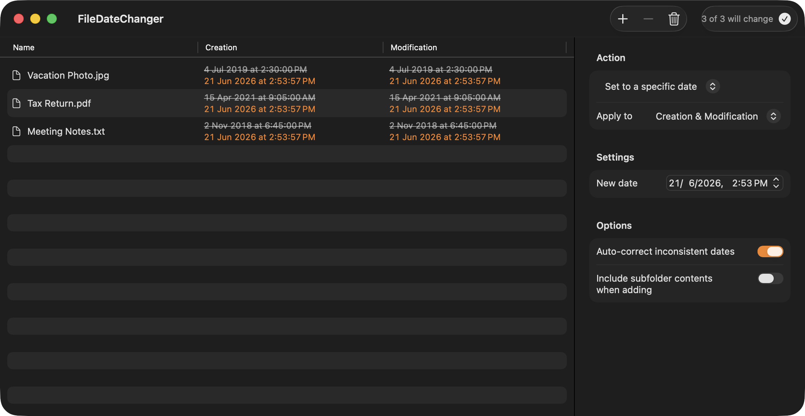

# File Date Changer

[](https://github.com/Grigaliunas/FileDateChanger/actions/workflows/ci.yml)

A native macOS app for batch-changing the **creation** and **modification** dates
of files and folders. A modern SwiftUI reimplementation of the discontinued
*File Date Changer 5* by Frank Reiff.

> Requires macOS 14 (Sonoma) or later.



## Features

- **Drag & drop** files/folders onto the window, or **File ▸ Add Files… (⌘O)**.
- **Live preview** — a table shows each item's current dates with the new value
  beneath it (struck through, in accent color), so what you see is exactly what
  gets written.
- **Actions:**
  - **Set to a specific date** — pick a date/time for creation, modification, or both.
  - **Add / remove time** — shift existing dates by days/hours/minutes/seconds.
  - **Copy creation → modification** and **modification → creation**.
  - **Lift dates from another file** — copy a reference file's dates onto your items.
  - **Remove dates** — clears the date so the Finder shows it as `-----`.
- **Apply to** creation only, modification only, or both.
- **Auto-correct inconsistent dates** — clamps future dates to now and keeps
  modification ≥ creation, mirroring the rules macOS enforces.
- **Batch apply** with a confirmation step and a success/error summary.

## Build & run

```bash
# Open in Xcode and run with ⌘R
open FileDateChanger.xcodeproj

# …or build from the command line
xcodebuild -project FileDateChanger.xcodeproj -scheme FileDateChanger -configuration Debug build
```

The app runs un-sandboxed so it can read and write dates on any file you choose;
it is ad-hoc signed ("Sign to Run Locally"), which is fine for personal use.
Distributing it would require a Developer ID and notarization.

## Tests

```bash
xcodebuild -project FileDateChanger.xcodeproj -scheme FileDateChanger -destination 'platform=macOS' test
```

28 tests written with **Swift Testing**:
- `FileDateServiceTests` — the pure planning/correction/expansion logic.
- `FileDateApplyTests` — integration tests that apply changes to real temp files
  and read the dates back from disk.

## How it works

Single window, one-way data flow through a `@MainActor` store (`AppModel`).

- All date logic lives in **`FileDateService`** as stateless functions.
  `plannedChange(for:config:)` is a **pure function**, so the preview shown in
  the table and the actual write are computed by the exact same code.
- `PlannedChange` maps each item to its new dates and drives both the preview and
  the write (`FileDateService.apply`).
- Removing a date writes the HFS+ epoch-zero sentinel (1904-01-01 00:00:00 GMT),
  which the Finder renders as `-----`.

See [`CLAUDE.md`](CLAUDE.md) for a deeper architecture tour and gotchas.

## Project layout

```
FileDateChanger/            App sources
  FileDateChangerApp.swift  Entry point, menu commands, date formatting
  Models/                   AppModel, ActionConfig, PlannedChange, FileItem
  Services/                 FileDateService (all date logic)
  Views/                    ContentView, ActionPanelView
  Assets.xcassets/          App icon + accent color
FileDateChangerTests/       Swift Testing unit + integration tests
Tools/generate-appicon.swift  Regenerates the app icon set
```

## App icon

The icon set is generated, not hand-drawn. To regenerate after a design tweak:

```bash
swift Tools/generate-appicon.swift
```

## Credits

Inspired by *File Date Changer 5* by Frank Reiff (publicspace.net), which is no
longer available.
